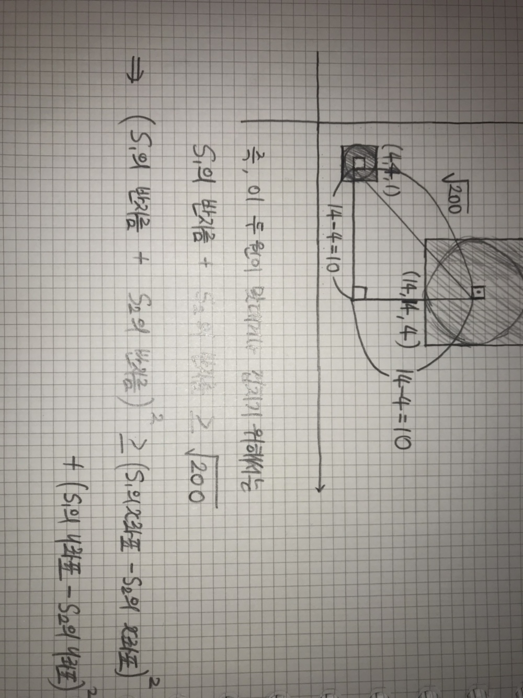

# [백준(10216)_dfs, UnionFind](https://www.acmicpc.net/problem/10216)

---

```javascript
//메모리초과
const fs = require('fs');
const stdin = (process.platform === 'linux'
    ? fs.readFileSync('/dev/stdin').toString()
    : `2
2
0 0 1
1 0 1
3
0 0 1
2 0 1
10 0 5`
).split('\n');

const input = (() => {
    let line = 0;
    return () => stdin[line++];
})();
let graph = Array.from(Array(5001), () => Array(5001).fill(0))
// let visited = Array.from(Array(5001), () => Array(5001).fill(0))
let T = parseInt(input())
while (T--) {
    const N = parseInt(input())
    const Direction = [[-1, 0], [1, 0], [0, -1], [0, 1]]
    let ans = 0
    const dfs = ((x, y) => {
        if (graph[x][y] !== 1)
            return
        graph[x][y] = 2
        for (let dir of Direction) {
            let nextX = x + dir[0]
            let nextY = y + dir[1]
            if (0 <= nextX && nextX < 5001 && 0 <= nextY && nextY < 5001 && graph[nextX][nextY] === 1) {
                dfs(nextX, nextY)
            }
        }
    })
    for (let i = 0; i < N; i++) {
        let [x, y, R] = input().split(' ').map((A) => parseInt(A))
        graph[x][y] = 1
        for (let j = 1; j <= R; j++) {
            for (let dir of Direction) {
                let nextX = x + dir[0] * j
                let nextY = y + dir[1] * j
                if (0 <= nextX && nextX < 5001 && 0 <= nextY && nextY < 5001) {
                    graph[nextX][nextY] = 1
                }
            }
        }
    }
    for (let i = 0; i < 5001; i++) {
        for (let j = 0; j < 5001; j++) {
            if (graph[i][j] == 1) {
                dfs(i, j)
                // console.log(i, j)
                ans++
            }
        }
    }
    console.log(ans)
    graph = Array.from(Array(5001), () => Array(5001).fill(0))
}
```

C++이었다면 이런 식의 아이디어로 쉽게 풀 수 있었을 것이다. 하지만, 자바스크립트의 경우 바로 메모리초과가 난다. 때문에 다른 아이디어가 필요했다

도무지 내 머리로는 아이디어를 떠올릴 수가 없어서 다른 코드를 찾아보던 중 유니온-파인드를 통해 푼 문제를 보았다. 

> https://js1jj2sk3.tistory.com/63

솔직히 어떻게 이런 아이디어를 떠올렸는지 이해가 되지 않는다. 정말 대단한 아이디어와 코드라고 생각한다. 이 아이디어를 바탕으로 자바스크립트로 이 문제를 해결했다.

```javascript
const fs = require('fs');
const { findSourceMap } = require('module');
const stdin = (process.platform === 'linux'
    ? fs.readFileSync('/dev/stdin').toString()
    : `2
2
0 0 1
1 0 1
3
0 0 1
2 0 1
10 0 5`
).split('\n');

const input = (() => {
    let line = 0;
    return () => stdin[line++];
})();

let T = parseInt(input())
while (T--) {
    const N = parseInt(input())
    let graph = Array.from(Array(N), () => Array(3).fill(0))
    let parent = new Array(N)
    let rank = new Array(N).fill(0)
    let ans = N

    const findParent = (v) => {
        if (parent[v] !== v) {
            parent[v] = findParent(parent[v])
        }
        return parent[v]
    }

    const unionParent = (v, u) => {
        const root1 = findParent(v)
        const root2 = findParent(u)
        if (root1 !== root2) {
            if (rank[root1] > rank[root2]) {
                parent[root2] = root1
            } else {
                parent[root1] = root2
                if (rank[root1] === rank[root2]) {
                    rank[root2]++
                }
            }
        }
    }

    for (let i = 0; i < N; i++) {
        let [x, y, R] = input().split(' ').map((A) => parseInt(A))
        graph[i][0] = x
        graph[i][1] = y
        graph[i][2] = R
        parent[i] = i
    }

    for (let i = 0; i < N; i++) {
        for (let j = i + 1; j < N; j++) {
            let x = graph[i][0] - graph[j][0]
            let y = graph[i][1] - graph[j][1]
            let r = graph[i][2] + graph[j][2]
            let d = x * x + y * y

            if (d <= r * r) {
                if (findParent(i) !== findParent(j)) {
                    unionParent(i, j)
                    ans--
                }
            }
        }
    }
    console.log(ans)
}
```

유니온파인드를 사용하면 훨씬 더 간단해지고, 시간복잡도도 줄어들며 메모리 소비도 줄일 수 있다.

이런 아이디어가 나올 수 있던 이유는 크기를 구하는 것이 아닌 **총 몇 개로 묶이는 지만 구하면 된다**는 사실 때문이다. (**총 몇 개로 묶인다 => 유니온파인드에 어울리는 단어이다.** )

이 코드의 가장 핵심인 맨마지막 부분의 for loop를 설명하기 위해 그림을 그렸다.



결국 이 문제에서 주어지는 x, y, R의 변수명은 각각 x좌표, y좌표, 반지름(radius)을 위한 것이었다.

또한, 문제의 설명에서도 **통신탑, 통신영역**이라는 단어를 통해 주어지는 좌표들이 **원**을 만들기위함이었다는 것을 눈치챘어야 했다.(그림에서는 그리기 편하게 사각형으로 그렸지만 실제로는 x, y를 원점으로 가지는 반지름 R의 원을 그렸어야 했다.)

---

## 👀느낀점

되게 좋은 문제고 많은 걸 배운 느낌이다. 항상 전형적인 유니온파인드 문제만을 풀어왔다. 때문에 이런 문제를 보고 유니온파인드로 풀어야겠다는 생각은 조금도 하지 못했다. 유니온파인드 부류의 문제들을 조금씩 풀어보고 익숙해져야할 필요가 있을 것 같다. 