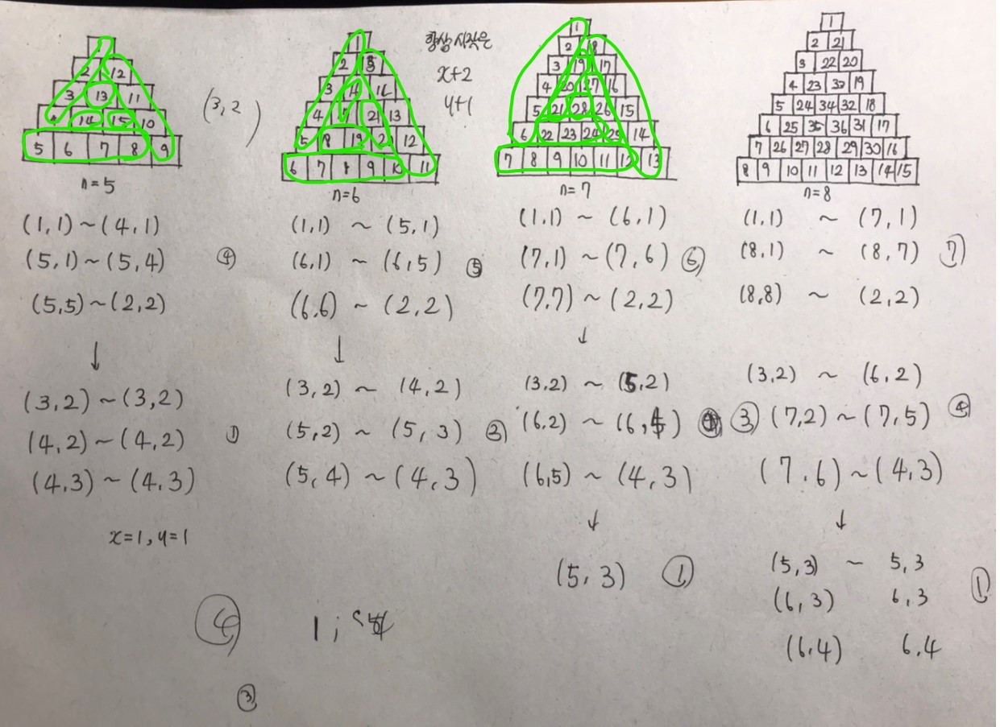

# [프로그래머스(삼각 달팽이)](https://programmers.co.kr/learn/courses/30/lessons/68645)

---

```javascript
function solution(n) {
    let answer = []
    let graph = new Array(n+1);
    for(let i=1;i<graph.length;i++){
        graph[i] = new Array(i+1);
    }
    let x=1;
    let y=1;
    let chkNum = n-1; 
    let cnt = 1;
    while(chkNum>=0){
        if(!chkNum){
            graph[x][y] = cnt++;
        }
        // ↙방향
        for(let i=x;i< x+chkNum;i++){
            graph[i][y] = cnt++;
        }
        // →방향
        for(let i=y;i<y+chkNum;i++){
            graph[x+chkNum][i] = cnt++;
        }
        // ↖방향
        for(let i=0;i<chkNum;i++){
            graph[(x+chkNum)-i][(y+chkNum)-i] = cnt++;
        }
        x += 2;
        y++;
        chkNum -= 3;
    }
    
    for(let i=1;i<=n;i++){
        for(let j=1;j<=i;j++){
            answer.push(graph[i][j])
        }
    }
    return answer;
}
```


---

하.... 거의 2시간이 걸렸다...

처음 1시간 동안은 어떠한 규칙이 있을 것이라 생각하고 규칙을 찾으려고 노력했다. 별의 별 짓을 다했지만 딱히 규칙이 보이지 않아 그냥 문제에서 주어지는 규칙을 사용하기로 했다.

↙ → ↖ 바로 이 3개의 방향을 반복 하는 것이다. 일단 이 3개가 반복된다는 것을 파악하고 다시 규칙을 찾기 위해 노력했다.



규칙은 다음과 같다. 기본적으로 그림은 저렇게 그려놨지만, 왼쪽 벽으로 밀어놓은 배열이라는 생각으로 봐야 한다.

일단 첫 순회때  ↙ → ↖ 이 방향을 각각 n-1번씩 처리하게 된다. 다음 순회때는 (n-1) - 3 번 또 그 다음 순회 때는 (n-1) - 3 - 3 번 순회하게 된다. 

↙ 방향 기준에서 일단 첫 순회때 (1, 1) 에서 시작하게 된다. 그 다음 순회 때는 y축은 2칸 증가하고 x축은 1칸 증가하게 된다.(내 코드 상에서는 x와 y의 값이 바뀌어 있다.) 

이 증가된 x값과 y값을 바탕으로 → ↖ 이 두 방향을 보게 되면 쉽게 규칙을 찾을 수 있다.

---

## ❤느낀점

오래 걸렸지만 뭔가 재밌었다. 내 머리로 끝까지 풀어낼 수 있어서 다행이다.

배열을 만들 때 (n+1) * (n+1) 배열을 만들려다가

```javascript
let graph = new Array(n+1);
    for(let i=1;i<graph.length;i++){
        graph[i] = new Array(i+1);
    }
```

이 코드를 활용하여 계단식의 2차원 배열을 선언했다. 이 문제의 경우 계단식이기 때문에 이런 식으로 배열을 선언할 수 있었지만, 만약에 들쑥날쑥한 모양이 필요하다면

 `let graph = new Array(n+1);` 이것만 해놓고 `graph[i]` 에 `push` 하는 형태로 배열을 만들어야 할 것 같다. 나중에 그런 문제가 나오면 한 번 시도해봐야겠다.